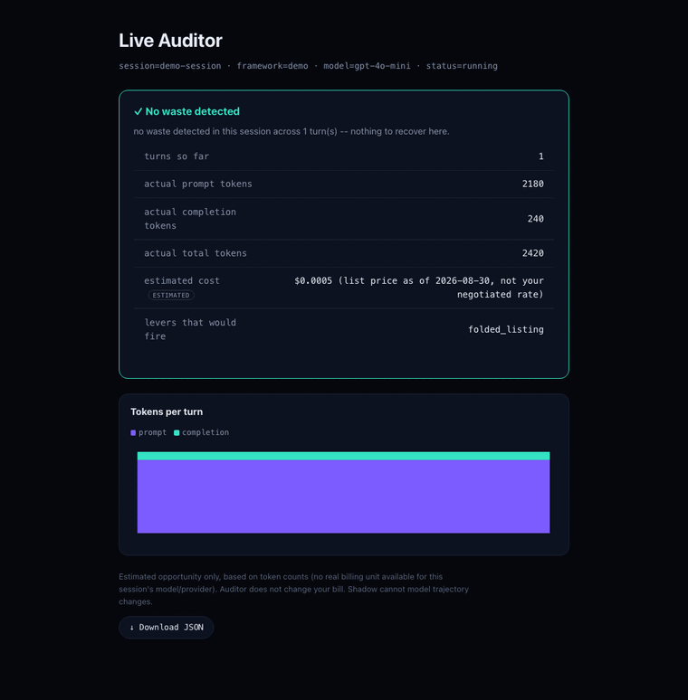
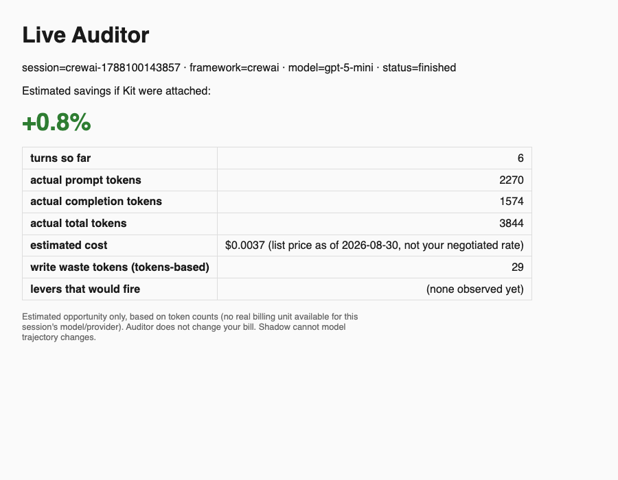

# contextos-auditor

[](https://pypi.org/project/contextos-auditor/)
[](https://pypi.org/project/contextos-auditor/)
[](./LICENSE)

The free, local-only Agent Auditor. Attach one line to
an existing CrewAI / LangGraph / AutoGen / OpenAI Agents SDK agent and
watch its real token cost live — no code changes to your tools/prompts,
no signup, no telemetry, **no data ever leaves your machine**. Licensed
[PolyForm Shield](./LICENSE) — free for **any** use, including commercial
use inside your company; the only restriction is that you can't use it to
build a competing product.

```bash
pip install contextos-auditor        # no extras needed to look around
contextos-auditor demo --serve       # see it work, no agent required
```



*Six turns of a synthetic session. Waste appears as the agent re-reads files it
had already read. Generated by `contextos-auditor demo` — no agent, no API key,
no network.*

That runs a synthetic session through the real analysis and opens the
dashboard on `127.0.0.1` — no agent, no API key, no network, nothing
written outside the current directory. It's the fastest way to see what
this actually produces before wiring it into anything.

When you're ready to point it at your own agent:

```bash
pip install contextos-auditor[crewai]        # or [langgraph] / [autogen] / [openai-agents] / [all]
contextos-auditor doctor                     # prints the one-line snippet for your framework
```

Requires Python >= 3.10. Zero required runtime dependencies — every
framework SDK above is an optional extra you opt into.



*A real `watch --serve` screenshot from a live CrewAI run — actual token
counts, estimated $ cost, and detected waste tokens, not a mockup.*

### "I don't have a Python env set up"

If you're attaching this to your own agent: CrewAI/LangGraph/AutoGen/
OpenAI Agents SDK are all Python-native frameworks, so if your agent runs
at all, you already have a working Python + pip — that's how you installed
the framework itself. The `attach()`/callback-handler snippet has to be
`pip install`ed into that *same* interpreter no matter what, since it hooks
the framework's own event bus from inside your process.

If your `pip install` fails with an `externally-managed-environment` error
(common on recent macOS/Debian system Pythons), use one of:

```bash
pipx install "contextos-auditor[crewai]"     # isolates it into its own venv automatically
uv pip install "contextos-auditor[crewai]"   # if you already use uv
```

If you just want to **view** a session someone else's agent produced (a
teammate, a CI run, a reviewer) and don't want to touch Python/pip at all,
grab the standalone `contextos-auditor` binary from the
[GitHub Releases](../../releases) page instead — it only does `watch`/
`report`/`doctor` (no framework adapter, since those must live inside the
agent's own process either way):

```bash
./contextos-auditor watch --serve   # same CLI, zero Python required
```

See `scripts/build_binary.sh` if you want to build one yourself.

## Quickstart

```python
# crewai
from contextos_auditor.crewai import attach
audit = attach(task="fix the bug")
crew.kickoff()
audit.detach()
```

```python
# langgraph / any langchain_core-based agent
from contextos_auditor.langgraph import AuditorCallback
handler = AuditorCallback(task="fix the bug")
graph.invoke({"messages": [...]}, config={"callbacks": [handler]})
handler.finish()
```

```python
# openai agents sdk
from contextos_auditor.openai_agents import attach
audit = attach(task="fix the bug")
result = await Runner.run(agent, "do the thing")
audit.detach()
```

```python
# autogen
from contextos_auditor.autogen import new_session, wrap_client, audit_tool
session = new_session(task="fix the bug")
client = wrap_client(real_client, session)
agent = AssistantAgent("coder", model_client=client, tools=[audit_tool(write_file, session)])
...
session.finish()
```

Then, from a terminal, while (or after) your agent runs:

```bash
contextos-auditor watch              # live terminal table, auto-picks the
                                       # most recent session
contextos-auditor watch --serve       # localhost-only live view in a browser
                                       # tab (Server-Sent Events, no polling)
contextos-auditor report <id> --html out.html   # one-shot static HTML report
contextos-auditor doctor              # check which framework hooks are
                                       # available in this environment
```

Not sure any of this is working? Run `contextos-auditor doctor` first —
it tells you exactly which framework SDKs it can see and prints the
correct snippet for each, before you touch your agent code at all.

## Reading the trace

Both the terminal output and the dashboard now show a nested **turn →
tool call** trace under the summary totals (AUD-013) — not just the
bottom-line numbers. Each turn lists the tools called during it, and any
write that would have been smaller with a hunk-based edit is called out
inline, on the exact turn it happened, in red:

```
turn 6: 689 tokens (prompt=613 completion=76)
  +-- write_file
      L waste detected: write to config/service.yaml could have been
        29 tokens smaller with a hunk-based edit
```

## Viewing past sessions

Every run is written to its own directory under `--audit-root`
(`.contextos/audit` by default) and never overwritten or pruned. To see
every recorded session at a glance — not just the most recent one that
`watch`/`report` show by default — run:

```bash
contextos-auditor history                # newest 20 sessions
contextos-auditor history --limit 0      # every session, no cap
contextos-auditor history --limit 5      # newest 5
```

This reads only the `session.json`/JSONL files each session already
writes — no separate database, no aggregation step to keep in sync.

## What it actually measures

Every number is a real token count pulled from the framework's own usage
reporting (CrewAI's `LLMCallCompletedEvent.usage`, LangChain's
`AIMessage.usage_metadata`, the OpenAI Agents SDK's tracing spans,
AutoGen's `ChatCompletionClient.create()` return value) — never a
heuristic or an extra network call. The "savings if Kit were attached"
figure is a **local, offline estimate** computed from your own recorded
tool calls — it does not change your bill, and it is clearly labeled
`estimated` everywhere it appears, never presented as a measured result.

Two kinds of waste are counted, and both are shown with the arithmetic
that produced them, so you can check the headline rather than trust it:

1. **Whole-file rewrites.** Your agent sent an entire file to change a
   few lines. The waste is the size of the full write minus the size of
   the equivalent hunk-based edit.
2. **Duplicate context.** Your agent re-read content it was already
   carrying in the transcript. That content is billed again in the prompt
   of *every* turn that follows it, so the waste is its size multiplied
   by the number of turns it was carried through. In long ReAct loops
   this is usually the larger of the two.

The duplicate-context figure is an **upper bound** on providers that bill
repeated prompt prefixes at a cached-token discount — the trace doesn't
tell us whether caching was active for your run. The total is also
clamped to the prompt tokens the session actually spent, so the estimate
can never claim more waste than the run demonstrably paid for.

**$ cost** is shown alongside token counts when your session's model is
in a small, hand-curated, dated pricing snapshot
(`contextos_auditor/_internal/pricing.py`), sourced from
[litellm's publicly maintained pricing table](https://github.com/BerriAI/litellm/blob/main/model_prices_and_context_window.json).
This is a **list-price estimate, not your actual bill**: providers change
prices without notice, this snapshot will go stale, and volume
discounts/enterprise agreements/cached-token pricing are not modeled. If
your model isn't in the table, the Auditor shows "no dated pricing
available" — it never guesses or interpolates a number.

## Exporting to your existing observability stack (optional)

By default, the Auditor only ever writes to a local JSONL/JSON directory
on your disk — nothing else. If your team already runs an OTel collector
(Datadog, Grafana, Honeycomb, Jaeger, ...), you can *additionally* export
each turn as a real OTel span following the
[OTel GenAI semantic conventions](https://opentelemetry.io/docs/specs/semconv/gen-ai/)
(`gen_ai.system`, `gen_ai.request.model`, `gen_ai.usage.input_tokens`, ...):

```bash
pip install contextos-auditor[otel]
```

```python
audit = attach(task="...", otel_endpoint="http://localhost:4318/v1/traces")
# or, with zero code changes:
# CONTEXTOS_OTEL_ENDPOINT=http://localhost:4318/v1/traces python your_agent.py
```

This is strictly additive and opt-in: nothing is exported unless you set
one of the two above, the local JSONL trail is completely unaffected
either way, and if the optional package isn't installed or the endpoint
is unreachable, export is silently disabled (one `UserWarning`) rather
than breaking your agent's real run.

## Secret redaction (on by default)

Pattern-based secret redaction is **on by default**. Recognizable secret
*shapes* (AWS keys, OpenAI/GitHub/Slack-style tokens, JWTs, PEM private
keys, and generic credential assignments) are replaced with `[REDACTED]`
before anything is written to disk. Only the matched value is replaced --
**not** the whole tool call -- so the real file content that powers
write-waste detection is left intact.

It defaults on because the two failure modes aren't symmetric: a
credential written into a plaintext file (and possibly committed) can't be
un-written, whereas the cost of redaction being on is only that a
credential-shaped string reads as `[REDACTED]` in the trace view.

If you need the raw values -- e.g. you're debugging the auditor itself, on
data you know is safe:

```python
audit = attach(task="...", redact_secrets=False)
# or: CONTEXTOS_REDACT_SECRETS=0 python your_agent.py
```

This is a best-effort scrub for common secret patterns, not a guarantee
that no sensitive data of any kind is ever recorded -- if you need that
guarantee, don't pass secrets through tool args/results in the first
place.

## Privacy

Session data (`events.jsonl`/`session.json`) is written to a directory on
your own disk (`./.contextos/audit/<session-id>/` by default) and never
transmitted anywhere by this package. On the first `attach()` in a
process the auditor prints the exact path it is writing to and whether
redaction is on, so this is never a surprise (set `CONTEXTOS_QUIET=1` to
silence it in CI). `contextos-auditor watch --serve` binds a small local
HTTP server to `127.0.0.1` only -- it is never reachable from outside your
machine, and the process makes zero outbound network calls (see
`tests/test_no_network_calls.py`).

Tool calls are recorded with their real arguments and results (e.g. file
paths and contents your agent read/wrote) so the savings estimate can be
computed — this can include whatever your own agent's tools touch. Add
`.contextos/` to your project's `.gitignore` so session data never gets
committed alongside your code:

```
echo ".contextos/" >> .gitignore
```

## Where this comes from

This package is the public, standalone distribution of the same adapter
logic used inside the [toku](internal) or as a standalone [contextos-auditor](https://github.com/surajJha/contextOS-auditor) monorepo's
`dashboard/adapters/` (which is what the framework-comparison numbers on
the ContextOS marketing site are measured with) — copied here rather than
imported, so this package installs and runs with no dependency on that
monorepo being present. If the monorepo's adapters change, this package's
copies are updated to match by hand; they are not auto-synced.

## Development

```bash
pip install -e ".[dev,all]"
pytest tests/
```

## License

**Free for any use, including commercial.** Licensed under
[PolyForm Shield 1.0.0](https://polyformproject.org/licenses/shield/1.0.0) —
see [`LICENSE`](./LICENSE). Run it on your company's agents, inspect it,
fork it, modify it, ship it inside your product — no fee, no signup, no
commercial license to buy. The single restriction is **Noncompete**: you
may not use it to provide a product that competes with ContextOS. It is
source-available rather than OSI open source for exactly that reason, and
we'd rather say so plainly than blur the term.
